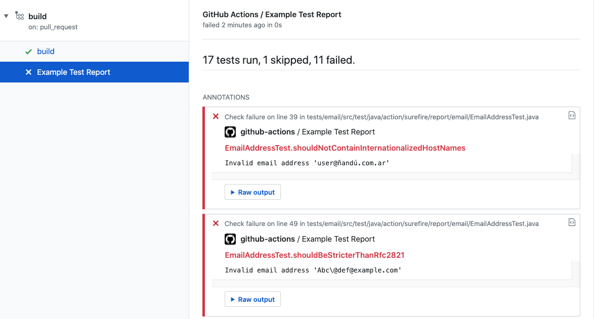

# GitHub Action: Process maven surefire reports


This action processes maven surefire or failsafe XML reports on pull requests and shows the result as a PR check with summary and annotations.



## Inputs

### `github_token`

**Required**. Usually in form of `github_token: ${{ secrets.GITHUB_TOKEN }}`.

### `report_paths`

Optional. [Glob](https://github.com/actions/toolkit/tree/master/packages/glob) expression to surefire or failsafe report paths. The default is `**/surefire-reports/TEST-*.xml`.

### `check_name`

Optional. Check name to use when creating a check run. The default is `Test Report`.

### `commit`

Optional. The commit sha to update the status. This is useful when you run it with `workflow_run`.

## Example usage

```yml
name: build
on:
  pull_request:

jobs:
  build:
    name: Build and Run Tests
    runs-on: ubuntu-latest
    steps:
      - name: Checkout Code
        uses: actions/checkout@v1
      - name: Build and Run Tests
        run: mvn test --batch-mode -Dmaven.test.failure.ignore=true
      - name: Publish Test Report
        uses: scacap/action-surefire-report@v1
        with:
          github_token: ${{ secrets.GITHUB_TOKEN }}
```

## Tips for Gradle

As Gradle uses a different build directory than Maven by default, you might need to set the `report_paths` variable:

```yaml
    report_paths: '**/build/test-results/test/TEST-*.xml'
```

You also need to enable JUnit XML reports as shown below.

```groovy
test {
  reports {
    junitXml.enabled = true
  }
}
```

## Tips for Gradle

Forked from: https://github.com/ScaCap/action-surefire-report